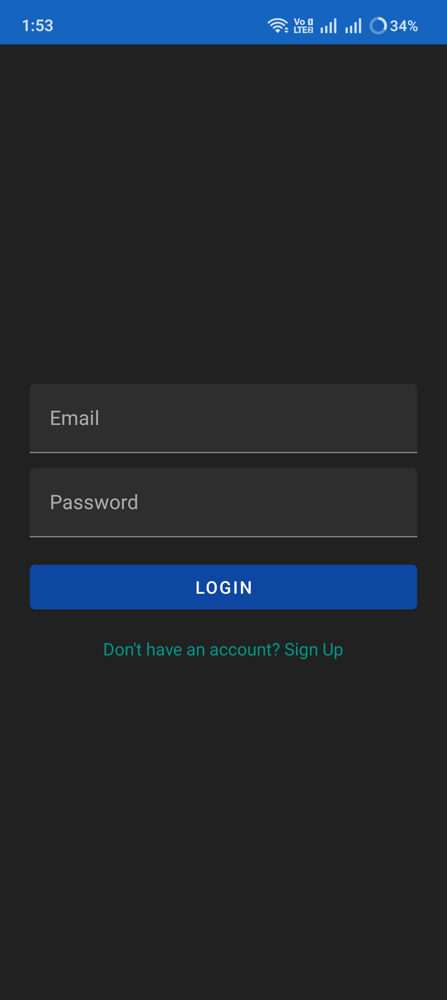
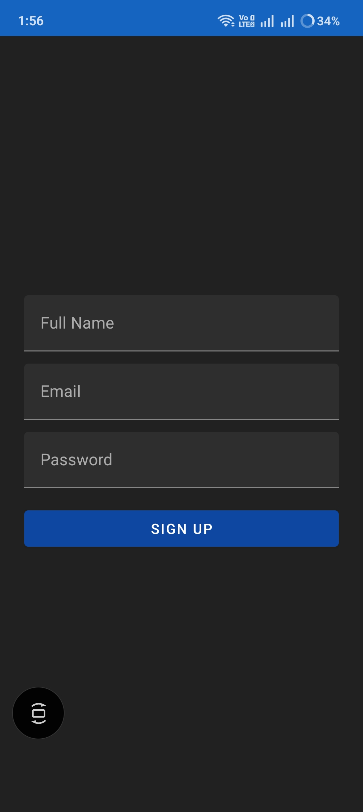
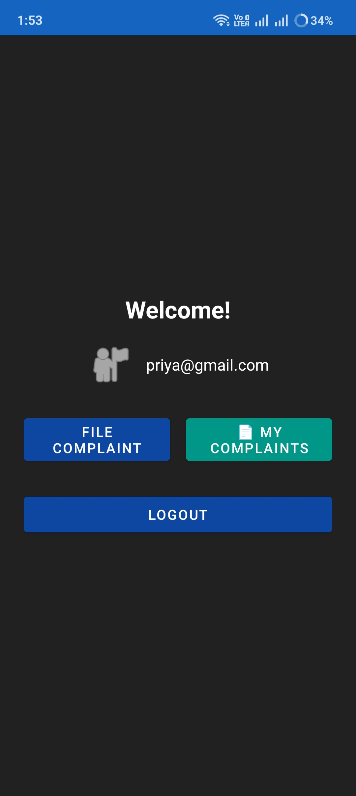

# UniBox — Unified Complaint Management System

UniBox is a centralized complaint management system designed to simplify the process of **submitting, tracking, managing, and resolving complaints** through a structured application.

The project was developed using **Java and Spring Boot**, with **REST APIs, JWT authentication, role-based authorization, JPA/Hibernate, and PostgreSQL**.

## 🚀 Key Features

* User registration and authentication
* JWT-based authentication
* Role-based authorization
* Complaint creation and submission
* Complaint tracking and status management
* Department-based complaint handling
* Location capture while submitting complaints
* Image attachment support for complaints
* Persistent data storage using PostgreSQL
* RESTful API architecture
* Layered backend architecture

## 🛠️ Tech Stack

| Technology          | Usage                            |
| ------------------- | -------------------------------- |
| **Java**            | Backend development              |
| **Spring Boot**     | Application framework            |
| **Spring Security** | Authentication and authorization |
| **JWT**             | Token-based authentication       |
| **REST APIs**       | Client-server communication      |
| **JPA / Hibernate** | ORM and database interaction     |
| **PostgreSQL**      | Relational database              |
| **Maven**           | Dependency management and build  |
| **Git**             | Version control                  |

## 🏗️ Architecture

UniBox follows a layered backend architecture to separate API handling, business logic, data access, and security concerns.

```text
Client
   ↓
REST Controller
   ↓
Service Layer
   ↓
Repository Layer
   ↓
PostgreSQL Database
```

### Main Components

**Controller Layer**

* Handles HTTP requests and responses
* Exposes REST endpoints
* Validates and processes incoming requests

**Service Layer**

* Contains business logic
* Processes user and complaint operations
* Coordinates between controllers and repositories

**Repository Layer**

* Handles database operations
* Uses JPA/Hibernate for persistence

**Security Layer**

* Handles authentication
* Validates JWT tokens
* Applies role-based authorization

## 🔐 Authentication & Authorization

UniBox uses **JWT-based authentication** to secure backend APIs.

The authentication flow is:

```text
User Login
    ↓
Credentials Validation
    ↓
JWT Token Generated
    ↓
Token Sent with API Requests
    ↓
JWT Validation
    ↓
Role-Based Access
```

Role-based authorization ensures that users can access functionality according to their assigned permissions.

## 🗄️ Database

The application uses **PostgreSQL** for persistent data storage.

### Main Entities

```text
Users
Departments
Complaints
```

The entities are mapped using **JPA/Hibernate**, allowing the application to perform database operations through the Java persistence layer.

## 📍 Complaint Submission

The complaint submission workflow supports:

* Complaint description
* Location capture using latitude and longitude
* Image selection/attachment
* Complaint submission through the application

Example workflow:

```text
Enter Complaint Details
        ↓
Capture Location
        ↓
Attach Image
        ↓
Submit Complaint
        ↓
Store Complaint in Database
```

## 🔌 REST API

The application exposes REST APIs for authentication and complaint management.

Example endpoints include:

```text
POST   /api/auth/login
POST   /api/complaints
GET    /api/complaints
GET    /api/complaints/{id}
PUT    /api/complaints/{id}/status
```

> **Note:** These are representative endpoints. Refer to the source code for the exact API paths and request/response structures implemented in the project.

## 🧪 API Testing

REST APIs were tested using **Postman** to verify:

* Request handling
* Authentication
* Authorization
* HTTP status codes
* API responses
* Complaint-related operations

### Postman API Testing


## 📸 Project Screenshots

### 🔐 Login



### 📝 User Registration



### 🏠 User Dashboard



### 📋 Complaint Submission


## 📂 Project Structure

```text
src
├── main
│   ├── java
│   │   └── ...
│   │       ├── controller
│   │       ├── service
│   │       ├── repository
│   │       ├── entity
│   │       ├── dto
│   │       ├── security
│   │       └── ...
│   │
│   └── resources
│       └── application.properties
│
└── test
```

## ⚙️ How to Run

### Prerequisites

Make sure the following are installed:

* **JDK 21** or compatible JDK
* **Maven**
* **PostgreSQL**
* **Git**

### 1. Clone the Repository

```bash
git clone YOUR_GITHUB_REPOSITORY_URL
cd unibox-backend
```

### 2. Configure PostgreSQL

Create a PostgreSQL database and configure the database connection in:

```text
src/main/resources/application.properties
```

Example:

```properties
spring.datasource.url=YOUR_DATABASE_URL
spring.datasource.username=YOUR_USERNAME
spring.datasource.password=YOUR_PASSWORD
```

> Do not commit actual database passwords, JWT secrets, or other credentials to the repository.

### 3. Build the Project

```bash
mvn clean install
```

### 4. Run the Application

```bash
mvn spring-boot:run
```

The application will start on the configured Spring Boot port.

## 🎯 What I Learned

Through UniBox, I gained practical experience in:

* Developing RESTful APIs using Spring Boot
* Implementing JWT-based authentication
* Applying role-based authorization
* Designing relational database structures
* Working with PostgreSQL
* Using JPA/Hibernate for database persistence
* Structuring applications using Controller, Service, and Repository layers
* Testing REST APIs using Postman
* Managing source code using Git
* Understanding the software development lifecycle
* Applying Agile development practices

## 🔮 Future Improvements

Potential improvements for future versions include:

* Email notifications for complaint updates
* Advanced complaint filtering and search
* Analytics and reporting dashboard
* Cloud deployment
* Automated unit and integration testing
* Docker containerization
* Improved monitoring and logging

## 👨‍💻 Author

**Prashant Kumar Gautam**

Aspiring Java Backend Developer

**Core Technologies**

`Java` · `Spring Boot` · `REST APIs` · `PostgreSQL` · `JPA/Hibernate` · `SQL` · `Git`

---

⭐ If you find this project useful, feel free to explore the repository and provide feedback.
